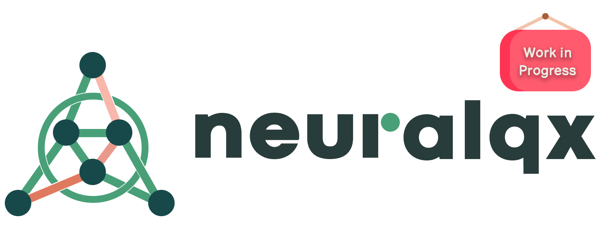

</img>

## __Description__

neuraLQX is an open-source Python package designed for high-performance simulations of 
canonical loop quantum gravity systems. Built on top of [NetKet](https://github.com/netket/netket.git) [1, 2], neuraLQX 
offers a complete and user-friendly environment for applying the machinery of NetKet specifically in the context of 
canonical loop quantum gravity with ease.

**Note:** The package is currently under development and will be released at a later date. Once available, it can be 
installed via pip. Check back here for the release data later.

**Release Date:** TBA

### __Key Features__

**Modular and Customizable Design:**
- **Flexible Quantum Models:** Easily construct custom quantum models, including various geometric and quantum 
operators.
- **Custom Graphs:** Design and implement custom graphs to fit specific needs.
- **Quantum Constraints:** Ready-to-use quantum constraints such as Gauß and Euclidean Hamilton constraints, with the 
ability to solve these using neural networks (see [NQS](https://www.science.org/doi/10.1126/science.aag2302) [3]).
- **Pre-trained Neural Networks:** Includes pre-trained novel neural networks capable of solving constraints across 
different models, saving time and effort.

**Advanced State Characterization and Analysis:**
- **State Characterization Tools:** Analyze states using tools like coloring operators, N-point functions and Rényi
entropy.
- **Multiple Hilbert Spaces:** Support for different Hilbert spaces (e.g. gauge-invariant subspaces).
- **Gauge Groups and Spacetime Dimensions:** Choose from different gauge groups (e.g., U(1)3, SU(2)) and 
spacetime dimensions, providing flexibility for diverse simulations.
- **Standard Models of Interest:** Implementations of some commonly used models, such as the torus universe, are 
included for convenience.

**High-Performance Computing (HPC) Friendly and Ease of Use:**
- **Parallelization Support:** Optimized for HPC environments, allowing for efficient parallel computations.
- **Seamless Installation and Setup:** Modular designed enabling the bypass technical difficulties, allowing you to 
focus on simulating systems rather than dealing with implementation issues.

## __Examples__

The package is still under development. However, its functionality has already been put to test. You can read about 
some systems explored using neuraLQX in this [paper](https://arxiv.org/abs/2405.00661) [4] and this 
[paper](https://arxiv.org/abs/2402.10622) [5] too.

You can also see some more in depth examples which showcase the intended usage of the package in our 
[tutorials page](/docs/Tutorials/). 

## __License__

This package will be available under the Apache 2.0 license. You can read about the Apache 2.0 license [here](/LICENSE).

## __References__

[1] F. Vicentini and others, “NetKet 3: Machine Learning Toolbox for Many-Body Quantum Systems,” SciPost Phys. Codeb., 
vol. 2022, p. 7, 2022, doi: 10.21468/SciPostPhysCodeb.7.

[2] G. Carleo et al., “NetKet: A machine learning toolkit for many-body quantum systems,” SoftwareX, vol. 10, p. 100311,
Jul. 2019, doi: 10.1016/j.softx.2019.100311.

[3] G. Carleo and M. Troyer, “Solving the quantum many-body problem with artificial neural networks,” Science, vol. 355,
no. 6325, pp. 602–606, 2017, doi: 10.1126/science.aag2302.

[4] H. Sahlmann and W. Sherif, “Towards quantum gravity with neural networks: Solving quantum Hamilton constraints of 3d
Euclidean gravity in the weak coupling limit,” May 2024 [arXiv: 2405.00661 [gr-qc]].

[5] H. Sahlmann and W. Sherif, “Towards quantum gravity with neural networks: Solving the quantum Hamilton constraint of
U(1) BF theory,” Feb. 2024 [arXiv: 2402.10622 [gr-qc]].
